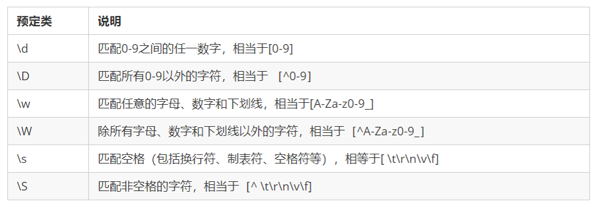

​	 

## 面向对象

先用对象结构描述出显示中每个事物的属性和方法,然后按需调用对象中保存的属性和方法

### 封装                                  js基础---对象

**利用对象字面量  创建对象{}**

**利用new object    创建对象**

**构造函数  function    创建对象**

>反复创建相同的结构的,但是属性不同的同一类型的多个对象是,就用构造函数
>
>构造函数不应该包含方法定义(浪费内存)  应该只包含属性函数的定义  
>
>通过继承定义公用的方法

```js
   function Student(sname, sage) {
            this.sname = sname;
            this.sage = sage;
            this.intr = function() {
                console.log(this.sname, this.sage);
            }
        }
        var lilei = new Student("li lei", 11);
        var hmm = new Student("hmm", 10);
        console.log(lilei);  //Student {sname: "li lei", sage: 11, intr: ƒ}
        console.log(hmm);//Student {sname: "hmm", sage: 10, intr: ƒ}
        lilei.intr();//li lei 11
        hmm.intr();//hmm 10
```


####　构造函数原型对象prototype (继承)

构造函数通过原型对象分配的函数是所有对象所共享的  (解决构造函数创建方法浪费内存的问题)。

每一个构造函数都有一个prototype 属性，指向一个原型对象，原型对象的所有属性和方法，都会被构造函数所拥有。**我们可以把那些不变的方法，直接定义在原型对象上，这样所有对象的实例就可以`共享`这些方法。**

```js
function Star(uname, age) {
    this.uname = uname;
    this.age = age;
}
Star.prototype.sing = function() {
	console.log('我会唱歌');
}
var ldh = new Star('刘德华', 18);
var zxy = new Star('张学友', 19);
ldh.sing();//我会唱歌
zxy.sing();//我会唱歌
```

 自有属性和共有属性:

 1). 获取属性值:都可用"子对象.属性名"

 2). 修改属性值: 

 i. 自有属性: 子对象.自有属性名=新值

 ii. 共有属性: 构造函数.prototype.共有属性名=新值

```js
function Student(sname, sage) {
            this.sname = sname;
            this.sage = sage;
        }
        //向Student类型的原型对象中添加一个共有属性
        Student.prototype.className = "初一2班"
        var lilei = new Student("Li Lei", 11);
        var hmm = new Student("Han Meimei", 12);
        console.log(lilei.sname, hmm.sname); //Li Lei Han Meimei
        console.log(lilei.className, hmm.className); //初一2班 初一2班

        //修改lilei的自有属性年龄
        lilei.sage++;
        console.log(lilei.sage, hmm.sage); //12 12
        lilei.className = "六年级2班";
        //结果lilei不但修改不了共有属性className，而且会自动在lilei对象中添加一个同名的自有属性className，保存和全班其它同学不同的班级名。
        //从此，李磊在className这一个属性的使用上，跟全班同学，分道扬镳！
        console.log(lilei.className, hmm.className); //六年级2班 初一2班
        //正确: 过了一年全班同学一起升级到初二2班
        Student.prototype.className = "初二2班";
        console.log(lilei.className, hmm.className); //六年级2班 初二2班
        console.log(lilei);
		/*
            className: "六年级2班"
            sage: 12
            sname: "Li Lei"
            __proto__:
            className: "初二2班"
            constructor: ƒ Student(sname, sage)
            __proto__: Object
         */
        console.log(hmm);
        /*
            sage: 12
            sname: "Han Meimei"
            __proto__:
            className: "初二2班"
            constructor: ƒ Student(sname, sage)
            __proto__:
        */
```


####　原型链

由多级父元素,逐级继承,形成的链式结构

​	每一个实例对象有一个__proto__属性，指向的构造函数的原型对象，原型对象也有__proto__属性，这样一层一层往上找就形成了原型链。

```js
function a(){};
a.prototype.name = "追梦子";
var b = new a();
console.log(b.name); //追梦子
```


#### 子构造函数继承父构造函数中的属性

1. 先定义一个父构造函数
2. 再定义一个子构造函数
3. 子构造函数继承父构造函数的属性(使用call方法)

```js
 // 1. 父构造函数
 function Father(uname, age) {
   // this 指向父构造函数的对象实例
   this.uname = uname;
   this.age = age;
 }
  // 2 .子构造函数 
function Son(uname, age, score) {
  // this 指向子构造函数的对象实例
  // 3.使用call方式实现子继承父的属性
  Father.call(this, uname, age);
  this.score = score;
}
var son = new Son('刘德华', 18, 100);
console.log(son);
```

#### 自定义继承

如果整个原型对象都不是想要的，  用自定义继承

setPrototypeOf    ==>  _ _proto_ _

Object.setPrototypeOf(子对象, 新父对象)

```js
       function Student(sname, sage) {
            this.sname = sname;
            this.sage = sage;
        }
        var lilei = new Student("Li Lei", 18);
        var hmm = new Student("Han Meimei", 19);
        var father = {
            money: 100000000000,
            car: "infiniti"
        }
        Object.setPrototypeOf(hmm, father);
        //    设置hmm的原型对象为father                      
        console.log(hmm.money, hmm.car); //100000000000 "infiniti"
        console.log(lilei.money, lilei.car); //undefined undefined
```


**更换所有子对象的父对象**: 创建子对象前更改构造函数的原型对象

```js
    var father = {
            money: 100000000000,
            car: "infiniti"
        }

        function Student(sname, sage) {
            this.sname = sname;
            this.sage = sage;
        }
        Student.prototype = father;
        //在创建子对象前改变构造函数的原型对象
        var lilei = new Student("Li Lei", 18);
        var hmm = new Student("Han Meimei", 19);


        console.log(hmm.money, hmm.car); //100000000000 "infiniti"
        console.log(lilei.money, lilei.car); //100000000000 "infiniti"
```


### 多态

什么是多态: 一个函数在不同情况下表现出不同的状态！

多态包含2种: 重载 和 重写

**重载:在一个类中同名不同参的方法分别被调用会产生不同的结果。**

```js

function add() {
        var sum = 0 ;
        for ( var i = 0 ; i < arguments.length; i ++ ) {
            sum += arguments[i];
        }
        return sum;
    }
    alert(add());
    alert(add( 1 , 2 ));
    alert(add( 1 , 2 , 3 ));

```


**重写:  如果子对象觉得从父对象继承来的成员不好用，可以在子对象自己内部重写和父对象同名的成员，覆盖父对象的成员，优先使用自己的。**    

```js
        function Student(sname, sage) {
            this.sname = sname;
            this.sage = sage;
        }
        Student.prototype.toString = function() {
            return `{ sname:${this.sname},sage:${this.sage}}`;
        }
        var lilei = new Student("Li Lei", 11);
        console.log(lilei.toString())
```


## class 创建类

专门集中保存一个类型的构造函数和所有原型对象方法的程序解构

class和构造函数中的属性不是共有属性,会成为每个子对象的自有属性


```js
  <script>
        class Star {
            //constructor是 构造器或者构造函数
            constructor(uname, age) {
                    this.uname = uname;
                    this.age = age;
                }
                // 共有方法
            sing(song) {
                console.log(this.uname + '唱' + song);
            }
        }
        // 2. 利用类创建对象 new
        var ldh = new Star('刘德华', 18);
        console.log(ldh); // Star {uname: "刘德华", age: 18}
        ldh.sing('冰雨'); // 刘德华唱冰雨
    </script>
```

### 继承 

**父对象中的成员,子对象无需重复创建,就可以直接使用**

构造函数不应该包含方法定义(浪费内存)  

继承既能重用方法,又能节约内存

希望一个方法只定义一次就能让所有新对象共同使用时,就能通过继承来实现

```js
class Father {
      constructor(surname) {
        this.surname= surname;
      }
      say() {
        console.log('你的姓是' + this.surname);
       }
}

class Son extends Father{  // 这样子类就继承了父类的属性和方法
}
var damao= new Son('刘');
damao.say();      //你的姓是刘
```


## super关键字

  ```js
  //定义了父类
  class Father {
     constructor(x, y) {
     this.x = x;
     this.y = y;
     }
     sum() {
     console.log(this.x + this.y);
  	}
   }
  //子元素继承父类
      class Son extends Father {
     		 constructor(x, y) {
      		super(x, y); //使用super调用了父类中的构造函数
      	}
      }
      var son = new Son(1, 2);
      son.sum(); //结果为3
  ```


## ES6新增方法

### 数组方法forEach遍历数组(迭代)

```js
 arr.forEach(function(value, index, array) {
       //参数一是:数组元素 
       //参数二是:数组元素的索引
       //参数三是:当前的数组
 })
  //相当于数组遍历的 for循环 没有返回值
```

```js
    var arr = ["a", "b", "c"];
        /*
        arr.forEach(function(value, index, array) {
                console.log("元素" + ":" + value, "下标" + ":" + index, "数组" + ":" + "[" + array + "]")
            })
        */
        //es6
        arr.forEach((value, index, array) => console.log(`元素:${value} 下标:${index} 数组:[${array}]`));
```


### 数组方法filter过滤数组

**filter() 方法创建一个新的数组，新数组中的元素是通过检查指定数组中符合条件的所有元素。**

从原数组复制出符合条件的元素，放入新数组。但是原数保持不变！

返回的数组中元素位置和原数组中元素位置不一定对应！

```js
  var array = [12, 66, 4, 88, 3, 7];
  var newArr = arr.filter(function(value,index,array) {
  	 //参数一是:数组元素
     //参数二是:数组元素的索引
     //参数三是:当前的数组
     return value >= 20;
  });
  console.log(newArr);//[66,88] //返回值是一个新数组
```

### 数组方法map

**map() 方法返回一个新数组，数组中的元素为原始数组元素调用函数处理后的值。**

基于原数组，修改后，生成一个新数组，原数组保持不变

```js
 var arr = [1, 2, 3, 4, 5];
        //想将原数组中每个元素值x2，然后放入新数组中返回。原数组保持不变
        var arr2 = arr.map(function(elem, i, arr) {
            console.log(`arr.map调用了一次回调函数。自动传入elem:${elem},i:${i},arr:${arr}。回调函数返回${elem*2}，放入新数组中[${i}]位置`)
            return elem * 2;
        })
        console.log(arr2); //[2,4,6,8,10]  新数组
        console.log(arr); //[1,2,3,4,5]    原数组
```


### 数组方法some

**查找数组中  是否有   满足条件的元素 **

只要查找到满足条件的一个元素就立马终止循环

```js
//some 查找数组中是否有满足条件的元素 
        var arr = [10, 4, 30];
        var arr1 = [10, 2, 30];
        var flag = arr.some(function(value, index, array) {
            console.log(`value=${value}`);
            //参数一是:数组元素
            //参数二是:数组元素的索引
            //参数三是:当前的数组
            return value < 3;
        });
        var flag1 = arr1.some(function(value, index, array) {
            console.log(`value=${value}`);
            return value < 3;
        });
        console.log(flag); //false返回值是布尔值,
        console.log(flag1); //true 只要查找到满足条件的一个元素就立马终止循环
```


### 数组方法 every

**检测数组   所有  元素是否都符合指定条件**

只要查找到不满足条件的一个元素就立马终止循环

```js
  var arr1 = [1, 2, 3, 4, 5]; //false
        var arr2 = [2, 4, 6, 4, 2]; //true
        //判断哪个数组全由偶数组成:
        var r1 = arr1.every(function(value, index, array) {
            console.log(`value=${value},index=${index},array=${array}`);
            return value % 2 == 0
                // 只要查找到不满足条件的一个元素就立马终止循环
        })
        var r2 = arr2.every(function(value, index, array) {
            console.log(`value=${value},index=${index},array=${array}`);
            return value % 2 == 0
        })
        console.log(r1, r2); // f  t
```


### 数组方法reduce

语法：`array.reduce(callback, [initialValue])`
<!-- reduce()方法接收callback函数， -->
`function callback(preValue, curValue, index, array)`

preValue: 上一次调用回调返回的值，临时汇总值（initialValue）

curValue: 数组中当前被处理的数组项

index: 当前数组项在数组中的索引值

array: 调用reduce()方法的数组

initialValue: 第一次调用callback函数时的临时汇总值 preValue

简书https://www.jianshu.com/p/3ab871b3a4f2

```js
        var arr = [1, 2, 3, 4, 5];
        var result = arr.reduce(
                function(preValue, curValue, index, array) {
                    return preValue + curValue;
                }, 0
            )
            //语法糖
            // var result = arr.reduce((box, elem) => box + elem, 0)
        console.log(result); //15
```


### 去除字符串中的空格

 str.trimLeft()     去除开头空格

 str.trimRight()  去除结尾空格

 str.trim()           去除两端空格

```js
var str = '   hello   '
console.log(str.trim()）  //hello 去除两端空格
```
详情看--->正则:删除敏感词

### 获取对象的属性名

Object.keys(对象) 获取到当前对象中的属性名 ，返回值是一个数组

```js
 var obj = {
     id: 1,
     pname: '小米',
     price: 1999,
     num: 2000
};
var result = Object.keys(obj)
console.log(result)//[id，pname,price,num]
```

### 保护对象 

#### Object.defineProperty

Object.defineProperty设置或修改对象中的属性

```js
Object.defineProperty(对象，"修改或新增的属性名"，{
		value:修改或新增的属性的值,
		writable:true/false,//如果值为false 不允许修改这个属性值
		enumerable: false,//enumerable 如果值为false 则不允许遍历
        configurable: false  //configurable 如果为false 则不允许删除这个属性 属性是否可以被删除或是否可以再次修改特性
})	
```

  1). writable: 控制是否可修改属性值
  2). enumerable: 控制着是否可被for in遍历到，但是只防for in      不防  .  访问
  3). configurable:	

> i. 是否可删除当前属性
> ii. 是否可修改writable和enumerable两个开关
>     强调: configurable一旦改为 false，不可逆！

#### Object.defineProperties() 

可同时修改多个属性中的开关

```js
       "use strict";
        var eric = {
                eid: 1001,
                ename: "埃里克",
                salary: 12000
            }
            //员工编号，禁止修改——只读
            //禁止删除ename属性
            //工资，禁止被for in随意遍历到
        Object.defineProperties(eric, {
            eid: {
                writable: false,
                configurable: false
            },
            ename: {
                configurable: false
            },
            salary: {
                enumerable: false,
                configurable: false
            }
        })

        //尝试修改eid属性
        // eric.eid = -2; 
        //尝试删除ename属性
        // delete eric.ename;
        //报错: Cannot delete property 'ename'
        //       不能   删除   属性      ename
        //尝试用for in遍历eric的每个属性
        for (var key in eric) {
            console.log(`${key} : ${eric[key]}`)
        }
        console.log(eric);
        console.log(`用点访问eric.salary:${eric.salary}`);
```


#### 访问器属性

```js
        var eric = {
                ename: "埃里克",
                eage: 25
            }
            //eage属性值可以修改，但是eage必须介于18~65之间
        Object.defineProperties(eric, {
            //1. 先定义实际存储属性值的受保护的半隐藏的隐姓埋名的属性
            _eage: {
                value: eric.eage, //从现在eric对象的旧属性eage中搬家到这里保护起来
                writable: true,
                enumerable: false,
                configurable: false
            },
            //2. 找替身，请保镖
            eage: {
                get: function() {
                    console.log(`自动调用了一次get()，返回${this._eage}`);
                    return this._eage;
                },
                set: function(value) {
                    console.log(`自动调用了一次set()，value接收到了新值${value}`)
                    if (value >= 18 && value <= 65) {
                        this._eage = value;
                    } else {
                        throw Error("年龄超范围！")
                    }
                },
                enumerable: true,
                configurable: false
            }
        })

        //想输出eric的eage属性值
        console.log(eric.eage);
        //想修改eric的eage为26
        eric.eage = 26;
        console.log(eric);
        //想修改eric的eage为-2
        eric.eage = -2;
```

#### 防扩展. Object.preventExtensions(对象)

禁止添加新属性

```js
        "use strict";
        var eric = {
                eid: 1001,
                ename: "埃里克",
                salary: 12000
            }
            //禁止给eric对象添加新属性: 
        Object.preventExtensions(eric);
        eric.Eid = 1002; //报错: 
        console.log(eric);
```


#### 密封Object.seal()

既禁止添加新属性，又禁止删除现有属性

```js
        "use strict";

        //一个员工对象
        var eric = {
                eid: 1001,
                ename: "埃里克",
                salary: 12000
            }
            // 密封
        Object.seal(eric);
        //试图给eric对象添加eid: 
        eric.Eid = 1002; //报错: 
        // 试图给eric对象删除ename: 
        delete eric.ename; //报错
        console.log(eric);
```


#### 冻结 Object.freeze();

 既禁止添加、删除属性，又禁止修改属性值

```html
  <script>
        "use strict"; //使用严格模式,冻结变量,再更改变量会报错
        const host = {
            url: "https://www.baidu.com",
            port: 443
        };
        Object.freeze(host); //冻结变量,冻结变量不可更改
        host.port = 80; //端口冻结前可以更改变量
        console.log(host);
    </script>
```


### object.create()

专门用于在没有构造函数的情况下也能创建子对象继承父对象。


创建一个新的空对象，并自动让新的空对象继承指定父对象

```js
   var father = {
            money: 100000000,
            car: "infiniti"
        }
        var hmm = Object.create(father);
        console.log(hmm);
        console.log(hmm.money, hmm.car);
```


既创建空对象，又继承父对象，还能给新对象添加自有属性

```js

        var father = {
            money: 100000000,
            car: "infiniti"
        }
        var hmm = Object.create(father, {
            phone: {
                value: "iPhone12",
                writable: true,
                enumerable: true,
                configurable: false
            },
            bao: {
                value: "GUCCI",
                writable: true,
                enumerable: true,
                configurable: false
            }
        });
        console.log(hmm);
        console.log(hmm.money, hmm.car);
```


## 函数的定义和调用

### 函数的定义方式

1. 方式1 函数声明方式 function 关键字 (命名函数)

   ```js
   function fn(){}
   ```

2. 方式2 函数表达式(匿名函数)

   ```js
   var fn = function(){}
   ```

3. 方式3 new Function() 

   ```js
   var f = new Function('a', 'b', 'console.log(a + b)');
   f(1, 2);

   var fn = new Function('参数1','参数2'..., '函数体')
   注意
   /*Function 里面参数都必须是字符串格式
   第三种方式执行效率低，也不方便书写，因此较少使用
   所有函数都是 Function 的实例(对象)  
   函数也属于对象
   */
   ```


### 函数的调用

```js
/* 1. 普通函数 */
function fn() {
	console.log('人生的巅峰');
}
 fn(); 


/* 2. 对象的方法 */
var o = {
  sayHi: function() {
  	console.log('人生的巅峰');
  }
}
o.sayHi();


/* 3. 构造函数*/
function Star() {};
new Star();


/* 4. 绑定事件函数*/
 btn.onclick = function() {};   // 点击了按钮就可以调用这个函数


/* 5. 定时器函数*/
setInterval(function() {}, 1000);  这个函数是定时器自动1秒钟调用一次


/* 6. 立即执行函数(自调用函数)*/
(function() {
	console.log('人生的巅峰');
})();
```

## this

### 函数内部的this指向

这些 this 的指向，是当我们调用函数的时候确定的。调用方式的不同决定了this 的指向不同

一般指向我们的调用者.


1. obj.fun() this->点前的obj对象

2. new Fun()  this->new正在创建的新对象

3. 类型名.prototype.共有方法=function(){ ... }   this->将来谁调用这个函数，就指谁将来调用这个函数的.前的某个子对象

4. fun() this->默认指window

5. 访问器属性中的this  ,指访问器属性所在的对象

6. 事件处理函数的this  ,指当前触发的这个元素对象\

7. jq的  对象.click(function(){})   的this指向点击的那个dom

8. jQuery.prototype.自定义函数=function(){

   ​			这里的this指向调用这个自定义函数的  .  前的jq子对象

   }


this是js的一个关键字，随着函数使用场合不同，this的值会发生变化。但是总有一个原则，那就是this指的是调用函数的那个对象
1.全局作用域或者普通函数中this指向全局对象window

```js
//直接打印
console.log(this) //window

//function声明函数
function bar () {console.log(this)}
bar() //window

//function声明函数赋给变量
var bar = function () {console.log(this)}
bar() //window

//自执行函数
(function () {console.log(this)})(); //window
```

2.方法调用中谁调用this指向谁

```js
//对象方法调用
var person = {
    run: function () {console.log(this)}
}
person.run() // person

//事件绑定
var btn = document.querySelector("button")
btn.onclick = function () {
    console.log(this) // btn
}
//事件监听
var btn = document.querySelector("button")
btn.addEventListener('click', function () {
   console.log(this) //btn
})

```

3.在构造函数或者构造函数原型对象中this指向构造函数的实例

```js
//不使用new指向window
function Person (name) {
    console.log(this) // window
    this.name = name;
}
Person('inwe')
//使用new
function Person (name) {
      this.name = name
      console.log(this) //people
      self = this
  }
  var people = new Person('iwen')
  console.log(self === people) //true
//这里new改变了this指向，将this由window指向Person的实例对象people
```

4.箭头函数中this箭头函数指向定义它时所处的对象
箭头函数this总是指向作用域，也就是外层调用者Person

```js
var Person = {
    firstName: 'hello',
    lastName: 'world',
    getFullName: function() {
        console.log(this)//{firstName: "hello", lastName: "world", getFullName: ƒ}
        var first = this.firstName // hello
        var fn = function() {
            console.log(this)//Window
            return this.firstName + this.lastName
        }
        return fn()
    }
}
Person.getFullName()

```

箭头函数this总是指向作用域，也就是外层调用者Person

5.call和apply可以改变this的指向

### 改变函数内部 this 指向

####  call方法

call()方法调用一个对象。简单理解为调用函数的方式，但是它可以改变函数的 this 指向

应用场景:  经常做继承. 

```js
var o = {
	name: 'andy'
}
 function fn(a, b) {
      console.log(this);
      console.log(a+b)
};
fn(1,2)// 此时的this指向的是window 运行结果为3


fn.call(o,1,2)//此时的this指向的是对象o,参数使用逗号隔开,运行结果为3
```

以上代码运行结果为:


> 调用函数
>
> 临时替换函数中的this为call()中的第一个实参值对象
>
> 将call()中的第二个实参值及其以后的所有剩余的实参值传给正在调用的函数作为函数的实参值

```js
 function scal(base, count1, count2) {
            console.log(this.ename, base + count1 + count2);
        }
        var lilei = {
            ename: "lilei"
        }
        var hmm = {
            ename: "hanmeimei"
        }
        scal(10000, 1000, 2000); //undefined 13000
        scal.call(lilei, 10000, 1000, 2000); //lilei 13000
        scal.call(hmm, 2000, 1000, 2000); //hanmeimei 5000
```


#### apply方法

apply() 方法调用一个函数。简单理解为调用函数的方式，但是它可以改变函数的 this 指向。

应用场景:  经常跟数组有关系

```js
var o = {
	name: 'andy'
}
 function fn(a, b) {
      console.log(this);
      console.log(a+b)
};
fn()// 此时的this指向的是window 运行结果为3
fn.apply(o,[1,2])//此时的this指向的是对象o,参数使用数组传递 运行结果为3
```


<!-- 利用apply借助数学内置对象求最大值 -->
```html
   <script>
        var arr = [1, 25, 345, 81, 384, 6];
        var max = Math.max.apply(Math, arr);
        console.log(max);
       
       /*
        var arr = [1, 25, 345, 81, 384, 6];
        var max = Math.max(...arr);
        console.log(max);
        */
    </script>
```


```js
        function scal(base, count1, count2) {
            console.log(this.ename, base + count1 + count2);
        }
        var lilei = {
            ename: "lilei"
        }
        var hmm = {
            ename: "hanmeimei"
        }
        var arr = [20000, 1000, 6000];
        scal.apply(lilei, arr); //lilei 27000
```


####  bind方法

bind() 方法不会调用函数,但是能改变函数内部this 指向,返回的是原函数改变this之后产生的新函数

如果只是想改变 this 指向，并且不想调用这个函数的时候，可以使用bind

应用场景:不调用函数,但是还想改变this指向

```js
 var o = {
 name: 'andy'
 };

function fn(a, b) {
	console.log(this);  
	console.log(a + b);
};
var f = fn.bind(o, 1, 2); //此处的f是bind返回的新函数
f();//调用新函数  this指向的是对象o 参数使用逗号隔开
```


> 不是调用函数，而是创建一个和原函数一模一样的函数副本！
>
> 新的计算函数的副本中的this被永久的替换为bind()第一个实参值对象
>
>  永久替换新函数副本中第一个形参变量的值为10000

```js
       function scal(base, count1, count2) {
            console.log(this.ename, base + count1 + count2);
        }
        var lilei = {
            ename: "lilei"
        }
        var hmm = {
            ename: "hanmeimei"
        }
        var scal2 = scal.bind(lilei, 10000);  //原函数改变this之后产生的新函数
        scal2(10000, 3000)    //lilei 23000
        scal2(5500, 3000)     //lilei 18500
```


#### call、apply、bind三者的异同

- 共同点 : 都可以改变this指向
- 不同点:
  - call 和 apply  会调用函数, 并且改变函数内部this指向.
  - call 和 apply传递的参数不一样,call传递参数使用逗号隔开,apply使用数组传递
  - bind  不会调用函数, 可以改变函数内部this指向.


- 应用场景
  1. call 经常做继承. 
  2. apply经常跟数组有关系.  比如借助于数学对象实现数组最大值最小值
  3. bind  不调用函数,但是还想改变this指向. 比如改变定时器内部的this指向. 

> 在一次调用函数时，临时替换一次this: 首选call
>
>  在一次调用函数时，需要多个实参值，但是多个实参值却是放在一个数组中保存的，需要打散数组并替换this: apply
>
>  反复使用一个函数，并永久替换this时：用bind()创建函数副本

## 严格模式中的变化

严格模式对 Javascript 的语法和行为，都做了一些改变。

```js
'use strict'
num = 10 
console.log(num)//严格模式后使用未声明的变量会报错
--------------------------------------------------------------------------------
var num2 = 1;
delete num2;//严格模式不允许删除变量
--------------------------------------------------------------------------------
function fn() {
 console.log(this); // 严格模式下全局作用域中函数中的 this 是 undefined
}
fn();  
---------------------------------------------------------------------------------
function Star() {
	 this.sex = '男';
}
// Star();严格模式下,如果 构造函数不加new调用, this 指向的是undefined 如果给他赋值则 会报错.
var ldh = new Star();
console.log(ldh.sex);
----------------------------------------------------------------------------------
setTimeout(function() {
  console.log(this); //严格模式下，定时器 this 指向 window
}, 2000);  
```
> 禁止给未声明的变量赋值
>
> 静默失败升级为错误
>
> 普通函数调用中的this不指向window,而指向undefined
>
> 禁用argument.callee


## 作用域和作用域链

(1). 用途: 一个变量的可用范围.

 (2). 本质: 也是一个专门保存变量的对象

避免不同范围之间的变量互相干扰！

####　全局作用域

* 专门保存全局变量的作用域范围/对象
* 随处可用！可反复使用！

* 今后只要需要反复使用一个变量或希望在任何位置都能使用这个变量时，都将变量创建在全局范围内！
* 全局作用域是一个名为window的对象！

​         1). 在浏览器一打开时，就自动创建

​         2). 我们在全局创建的所有变量和函数都是保存在window对象中！

 优点: 可反复使用！

 缺点: 随处可用——极易被污染！

#### 函数作用域

* 专门保存只能在函数内使用的局部变量的范围/对象
*  仅在函数内可用！不可重用！
* 只要希望一个变量只能在函数内使用，出了函数不能用时，都要将变量声明在函数作用域范围内

### 作用域链

　　**变量在当前作用域中没有查到值，就会向上级作用域去查，直到查到全局作用域，这么一个查找过程形成的链条就叫做作用域链。** 

## [闭包](https://blog.csdn.net/weixin_43586120/article/details/89456183)

闭包（closure）指有权访问另一个函数作用域中变量的函数。简单理解就是 **，一个作用域可以访问另外一个函数内部的局部变量**。

**外层函数调用后,由于外层函数的作用域对象被内层的函数引用着,无法释放,就形成了闭包**

> 让外部访问函数内部变量成为可能；
>
> 局部变量会常驻在内存中；
>
> 可以避免使用全局变量，防止全局变量污染；
>
> 会造成内存泄漏（应用闭包的内层函数,比普通的函数多占用一块外层函数的作用域对象）
>
> >解决:如果一个闭包不在使用,应该使内层的变量为null,从而释放

**外层函数向外抛出内层函数对象  三种方式:**

1.直接return

2.通过直接给全局变量赋值的方式,向外抛出一个函数

3.return一个对象或者数组,在对象和数组中保存多个函数定义


```js
 function fn() {
   var num = 10;
   function fun() {
       console.log(num);
 	}
    return fun;
 }
var f = fn();
f();
```
或
```js
 function fn() {
   var num = 10;
    return function () {
       console.log(num);
 	};
 }
var f = fn();
f();

```
```js
 function parent() {
            var total = 1000;
            return function(money) {
                total -= money;//本作用域内没有total所以取外层(parent)的total
                console.log(total);
            }
        }
        var pay = parent();
        pay(100); //900
        total = 0;//全局的total不影响parent作用域内的total
        pay(100); //800
        pay(100); //700
```

```js
 function outerFn() {
            var i = 0;
            //第一次调用完以后i=1
            //第二次调用用完以后i=2
            //第三次调用用完以后i=3
            function innerFn() {
                i++;
                console.log(i);
            }
            return innerFn;
        }
        var inner = outerFn();
        inner(); //1  
        inner(); //2
        inner(); //3
        var inner2 = outerFn();
        //每次外部函数执行的时候,都会开辟一块内存空间,外部函数的地址不同，都会重新创建一个新的地址
        inner2(); //1
        inner2(); //2
        inner2(); //3
```


### 利用闭包得到索引号

```html
<body>
    <ul>
        <li>0</li>
        <li>1</li>
        <li>2</li>
        <li>3</li>
    </ul>
    <script>
        var lis = document.querySelector('ul').querySelectorAll('li');
        for (var i = 0; i < lis.length; i++) {
            (function(i) {
                lis[i].onclick = function() {
                    console.log(i);
                }
            })(i)
        }
    </script>
</body>
```

### 利用闭包3秒后打印li里面的参数
```html
<body>
    <ul>
        <li>a</li>
        <li>b</li>
        <li>c</li>
        <li>d</li>
    </ul>
    <script>
        var lis = document.querySelector('ul').querySelectorAll('li');
        for (var i = 0; i < lis.length; i++) {
            (function(i) {
                setTimeout(function() {
                    console.log(lis[i].innerHTML);
                }, 3000)
            })(i)
        }
    </script>
</body>
```
## 递归 
```js
        function fn(n) {
            if (n == 1) {
                return 1;
            }
            return n * (n - 1)
        }

        console.log(fn(9));
```
### 斐波那契
1  1  2  3  5  8  13  21

```js
        function sum(n) {
            if (n === 1 || n === 2) {
                return 1;
            }
            return sum(n - 1) + sum(n - 2);
        }
        console.log(sum(6));
```
**使用递归的方法, 但是当数字过大时浏览器会出现假死现象。毕竟递归需要堆栈，数字过大内存不够。**

```js
  function fibonacci(n) {
        var num1= 1,num2= 1,sum;
        for(var i = 3; i <= n; i ++) {
            sum = num1 + num2
            num1 = num2
            num2 = sum
        }
        return sum
    }
	console.log(fibonacci(50));
```


## 深浅拷贝

浅拷贝：对对象地址的复制，不会进行递归复制，并没有开辟新的栈，也就是复制的结果是两个对象指向同一个地址。

深拷贝是:将原对象和属性一起赋值出去，复制到一份新的内存当中；
### 浅拷贝

```js
   
        // 浅拷贝只是拷贝一层, 更深层次对象级别的只拷贝引用.
        var obj = {
            id: 1,
            name: 'andy',
            msg: {
                age: 18
            }
        };
        var o = {};
        // for (var k in obj) {
        //     // k 是属性名   obj[k] 属性值
        //     o[k] = obj[k];
        // }
        // console.log(o);
        // o.msg.age = 20;
        // console.log(obj);


        // 语法糖写法
        Object.assign(o, obj);
        console.log(o);

```

### 深拷贝
```js
        // 深拷贝拷贝多层, 每一级别的数据都会拷贝.
        var obj = {
            id: 1,
            name: 'andy',
            msg: {
                age: 18
            },
            color: ['pink', 'red']
        };
        var o = {};
        // 封装函数 
        function deepCopy(newobj, oldobj) {
            for (var k in oldobj) {
                // 判断我们的属性值属于那种数据类型
                // 1. 获取属性值  oldobj[k]
                var item = oldobj[k];
                // 2. 判断这个值是否是数组
                if (item instanceof Array) {
                    newobj[k] = [];
                    deepCopy(newobj[k], item)
                } else if (item instanceof Object) {
                    // 3. 判断这个值是否是对象
                    newobj[k] = {};
                    deepCopy(newobj[k], item)
                } else {
                    // 4. 属于简单数据类型
                    newobj[k] = item;
                }

            }
        }
        deepCopy(o, obj);
        console.log(o);

        // 修改后对原来对象没有影响
        o.msg.age = 20;
        console.log(obj);
```


## 正则表达式概述

正则表达式（ Regular Expression ）是用于匹配字符串中字符组合的模式。在JavaScript中，正则表达式也是对象。

正则表通常被用来检索、替换那些符合某个模式（规则）的文本，例如验证表单：用户名表单只能输入英文字母、数字或者下划线， 昵称输入框中可以输入中文(匹配)。此外，正则表达式还常用于过滤掉页面内容中的一些敏感词(替换)，或从字符串中获取我们想要的特定部分(提取)等 。

### 正则表达式的创建

在 JavaScript 中，可以通过两种方式创建一个正则表达式。

方式一：通过调用RegExp对象的构造函数创建 

```js
var regexp = new RegExp(/123/);
console.log(regexp);
```

遇到  \s  之类的加  \   转义   比如\\\s

方式二：利用字面量创建 正则表达式


```js
 var rg = /123/;
```
这种方法只是适合正则表达式固定写死的. 由于 "  //  "只能只能写正则表达式无法写入js字符串,内部无法在程序运行时,根据其他条件动态生成正则表达式

### 测试正则表达式 

> test() 正则对象方法，用于检测字符串是否符合该规则，该对象会返回 true 或 false，其参数是测试字符串。

```js
var rg = /123/;
console.log(rg.test(123));//匹配字符中是否出现123  出现结果为true
console.log(rg.test('abc'));//匹配字符中是否出现123 未出现结果为false
```


### 边界符
> ^    表示匹配行首的文本
>  $    表示匹配行尾的文本
>
> \b  前边紧挨着单词的字母

注意:单独写\b什么也匹配不到   只匹配位置,不匹配字符


```js

        var fn = /^abc/;
        console.log(fn.test('abc')); //t
        console.log(fn.test('abc12')); //t
        console.log(fn.test('123abc')); //f
```

```js
      var fn = /^abc$/;     // 精确匹配 要求必须是 abc字符串才符合规范
        console.log(fn.test('abc')); //t
        console.log(fn.test('abc12')); //f

```

### 字符类
> []  只要包含有里面的字符就返回true
> [-]范围符
> ^在[]里面代表	取反


```js
       var fn = /abc/;     // /abc/ 只要包含有abc这个字符串返回的都是true 
        console.log(fn.test('abc')); //t
        console.log(fn.test('13abc')); //t
        console.log(fn.test('a123')); //f
        console.log(fn.test('a1b2c')); //f
```

```js

    var fn = /[abc]/;   //[]  只要包含有里面的字符就返回true
        console.log(fn.test('abc')); //t
        console.log(fn.test('13abc')); //t
        console.log(fn.test('a123')); //t
```

```js
  var fn = /^[abc]$/; //只能是a||b||c
        console.log(fn.test('ab')); //f
        console.log(fn.test('a')); //t
```

```js
  var fn = /^[a-c]$/; //只能是a||b||c
        console.log(fn.test('z')); //f
        console.log(fn.test('a')); //t
        console.log(fn.test('ac')); //f
```

### 量词符

量词符用来设定某个模式出现的次数。

| 量词    | 说明       |
| ----- | -------- |
| *     | 重复0次或更多次 |
| +     | 重复1次或更多次 |
| ?     | 重复0次或1次  |
| {n}   | 重复n次     |
| {n,}  | 重复n次或更多次 |
| {n,m} | 重复n到m次   |


#### 表单验证
```html
    <style>
        span {
            color: #ccc;
            font-size: 16px;
        }
        
        .right {
            color: green;
        }
        
        .wrong {
            color: red;
        }
    </style>
</head>

<body>
    <input type="text" class="text"> <span>请输入用户名</span>
    <script>
        var text = document.querySelector('.text');
        var span = document.querySelector('span');
        var reg = /^[a-zA-Z0-9_-]{6,16}$/;
        text.onblur = function() {
            if (reg.test(this.value)) {
                span.className = 'span right ';
                span.innerHTML = '通过';
            } else {
                span.className = 'span wrong ';
                span.innerHTML = '不通过';
            }
        }
    </script>
</body>
```

### 预定义类



### 查询敏感字

**indexof(searchvalue)    **           返回下标 (没找到返回-1),不支持正则

**search(regexp)**       返回下标 (没找到返回-1),支持正则

```js
 var msg = prompt("请输入要发送的消息内容:")

        var i = msg.search(/([我卧]|wo)\s*([草艹槽]|cao)/i); //i忽略大小写
        if (i != -1) {
            document.write(`<h1 style="color:red">发现敏感词！禁止发送!</h1>`);
        } else {
            document.write(`<h1 style="color:green">${msg}</h1>`);
        }
```

**match(searchvalue)   /   match(regexp)**

返回一个数组 (找不到返回null)

返回的数组中 

> arr["0"]  /  arr[0] :            匹配的内容       
>
>  arr["index"] / arr.index:   下标

 match(regexp/g)       g   全局

match加g以后**无法返回目标内容的下标**,只能返回目标**内容**

只能找第一个，无法向后继续找下一个


```js
 var str = "老师:请用 小红 我的 朋友造句。小亮:小红是我的朋友。小然:朋友！小红是我的！";
        //match不加g
        var arr = str.match(/小[\u4e00-\u9fa5]/);
        console.log(arr);
        //问题只能返回第一个敏感词的内容和位置。
        //尝试第二次查找: 
        arr = str.match(/小[\u4e00-\u9fa5]/);
        console.log(arr);
        //即使反复调用，也只能找第一个，无法向后继续找下一个

        //match加g
        var arr = str.match(/小[\u4e00-\u9fa5]/g);
        console.log(arr);
        //问题: 只能返回所有敏感词的内容，无法返回敏感词的位置
```


**exec() **

返回一个数组，其中存放匹配的结果。如果未找到匹配，则返回值为 null。

如果在一个字符串中完成了一次模式匹配之后要开始检索新的字符串

```js
var str = "老师:请用 小红 我的 朋友造句。小亮:小红是我的朋友。小然:朋友！小红是我的！";  
var reg = /小[\u4e00-\u9fa5]/g;
        //先查找一次，才能确定字符串中是否有敏感词，才能确定有没有必要继续找下一次
        do {
            var arr = reg.exec(str);
            if (arr != null) {
                //console.log(arr);
                console.log(`在位置${arr.index}，发现敏感词${arr[0]}`)
            }
        } while (arr != null); //只有在本次找到了敏感词时，才有必要继续循环下次查找
```


总结: 查找方法的返回值规律

1.如果原函数的是**返回下标的位置**,找不到返回-1

2.如果原函数的是**返回一个数组或一个对象**,找不到返回null


### 替换敏感字

1.  replace(regexp,要替换的内容)

```js
  var str = "小红去上课";
        var arr = str.replace(/小[\u4e00-\u9fa5]/g, '****')
        console.log(arr); //****去上课
```

2.  通过回调函数替换

   replace(regexp,回调函数)

   > 每找到一个敏感词replace就会自动调用一次提前准备好的回调函数

   ```js
      var str = "ni shi shuai ge";
           var str = str.replace(/\b[a-z]/g, function(a) {
               return a.toUpperCase();
           })
           console.log(str); //Ni Shi Shuai Ge
   ```


###　删除敏感词

 删除敏感词: 只要把敏感词替换为""

**定义三个函数，分别可以去掉字符串开头的空字符，字符串结尾的空字符，以及同时去掉开头和结尾的空字符**

去掉字符串开头的空字符

```js
function trimLeft(str){
      //找到字符串开头的多个空字符，替换为""
      return str.replace(/^\s+/,"");
    }
  //裁剪 结尾的空字符
function  trimRight(a) {
     return a.replace(/\s+$/, "");
    }
        //裁剪 开头和结尾的空字符
function  trim(a) {
    return a.replace(/^\s+|\s+$/g, "");
     }
```

es5新增

 str.trimLeft()

 str.trimRight()


### 分割

1. spilt()   有固定的切割符

```js
 var str = "315455509@qq.com";
        var arr = str.split("@");
        console.log(arr);
/*
Array(2)
0: "315455509"
1: "qq.com"
length: 2
*/
```

2.  切割符不固定,但是能找到规律时

   spilt(regexp)

```js
        var str = "  ni    hao    ya ";
        var arr = str.trim().split(/\s+/);
        console.log(arr);
/*
(3) ["ni", "hao", "ya"]
0: "ni"
1: "hao"
2: "ya"
length: 3

注意:   先去除前后两端的空格
*/
```

3.字符串转数组

翻转字符串

```js
 var str = "hello world";
        var arr = str.split("");
        str = arr.reverse().join("");
        console.log(str);
```


###　０宽断言

`/ab(?=[A-Z])/`

匹配后面跟随大写字母的字符串"ab"

`/ab(?![A-Z])/`

匹配后面不跟随大写字母的字符串"ab"

#### 千分符

`/\d(?=(\d{3})+(\.|$))/`

```js
    var str = "123456789.12";
        // $1,是匹配正则表达式第一个括号里的\d 替换为逗号
        var a = str.replace(/(\d)(?=(\d{3})+(\.|$))/g, "$1,");
        console.log(a);
//123,456,789.12
```

#### 强密码

6位以上至少包含一位大写字母和一位数字,不能有特殊符号

^(?![0-9a-z]+$)(?![A-Za-z]+$)[0-9A-Za-z]{6,}$


## Es6

不存在变量提升,解决了污染全局的问题;	

 ### let

- let 定义变量，变量不可以再次定义，但可以改变其值
- 具有块级作用域。（即大括号）
- 没有变量提升，必须先定义再使用
- let声明的变量不会压到window对象中，是独立的

**如果使用var声明了变量，也不能再次用let声明了，反之也是不行的。原因也是这个变量已经被声明过了。**

### const

- 使用const关键字定义常量
- 常量是不可变的，一旦定义，则不能修改其值
- 初始化常量时，必须给初始值
- 具有块级作用域
- 没有变量提升，必须先定义再使用
- 常量也是独立的，定义后不会压入到window对象中


<!-- 以下可以和闭包进行对比 -->
```html
<body>
    <ul>
        <li>a</li>
        <li>b</li>
        <li>c</li>
        <li>d</li>
    </ul>
    <script>
        var lis = document.querySelector('ul').querySelectorAll('li');
        for (let i = 0; i < lis.length; i++) {
            setTimeout(function() {
             console.log(lis[i].innerHTML);
            }, 3000)
        }
    </script>
</body>
```


### 箭头函数

1.如果只有一个参数,()可以省
2.如果单独只有return,{}和return可以省

```js
    <script>
        // window.onload = function() {
        //     alert('a');
        // }
        window.onload = () => {
            alert('a');
        }
    </script>
```
```js
x => x * x
上面的箭头函数相当于：

function (x) {
    return x * x;
}
```

可改变this指向   `改用箭头函数可以指向可以透过function`

```js
  var lilei = {
            sname: "lilei",
            firends: ["hmm", "lele", "wenwen"],
            intr: function() {
                this.firends.forEach(
                    function(value) {
                        // 此时this指向了window
                        console.log(this.sname, value);
                    }
                    /*
                        undefined "hmm"
                        undefined "lele"
                        undefined "wenwen"
                    */
                   
                )
            }
        }
        lilei.intr();
```

```js
  var lilei = {
            sname: "lilei",
            firends: ["hmm", "lele", "wenwen"],
            intr: function() {
                this.firends.forEach(
               		//此时指向lilei
                    value => console.log(this.sname, value)
                    /*
                    lilei hmm
                    lilei lele
                    lilei wenwen
                    */
                )
            }
        }
        lilei.intr();
```

对象中的方法简写

intr:function(){}             =======>               intr(){}


```js
var lilei = {
            sname: "lilei",
            firends: ["hmm", "lele", "wenwen"],
            intr() {
                this.firends.forEach(
                    value => console.log(this.sname, value)
                )
            }
        }
        lilei.intr();
```

**注意:**把intr:function(){}   改成箭头函数    intr=>{}   内部的this直接透过去指向了window  所以才简写成 intr(){}


####  箭头函数与普通函数的区别

* 箭头函数中的this与外部的this保持一致.但是普通函数的this与外部的this是无关的
* 箭头函数不能作为构造函数
* 箭头函数中不允许使用arguments

### 字符串模板

> ``反引号代替引号''
>
> 支持换行 单双引号
>
> **\`${表达式}`**


```js
    let uname = 'lei';
        let age = 20;
        let add = '武汉';
        console.log(
         `
        名字: ${uname}
        年龄: ${age+10}//可运算
        地址: ${add}
        `
        );
```


### 参数的收集和扩展

1.收集参数

```js
show = (a, b, ...args) => {  //...args必须写在数组后面
            alert(a);//12	
            alert(b);//25
            alert(args);//26  545  16  15  3
        }
        show(12, 25, 26, 545, 16, 15, 3)


  var obj1 = {
            a: 1,
            b: 2,
            f: 8
        }
        var obj2 = {
            d: 4,
            e: 5,
            f: 9
        }
        var obj = {
            ...obj1,
            c: 3,
            ...obj2
        }
        console.log(obj);
/*
a: 1
b: 2
c: 3
d: 4
e: 5
f: 9   obj1和2中的f同名   则obj2覆盖obj1内的f
*/
```

2.展开数组
展开后的效果,跟原数组的内容一样
```js
  let arr = [1, 2, 3];
        show = (a, b, c) => {
            alert(a);
            alert(b);
            alert(c);
        }
        show(...arr);
```

```js
        var arr = [2, 8, 5, 6];
        console.log(Math.max(arr)); //NaN   不能直接用于数组
        console.log(...arr); //2 8 6 5   打散后就不是数组了
        console.log(Math.max(...arr)); //8   打散以后求最大值
```


**在定义函数时是收集**

**在调用函数时是展开**


### 参数增强 ,设置参数的默认值

```js
function add(a,b=0,c=0){
    console.log(a+b+c);
}
add(80,59,71);
add(87,56);//未提供实参则会使用形参的默认值,未设置默认值结果为NaN
```

```js
     show = (a, b = 11, c = 22) => {
            console.log(a, b, c);   //66 11 22  b,c不传参数就按默认的来 
        }
        show(66);
```
### 解构赋值

#### 数组解构

```js
let [a, b, c] = [1, 2, 3];
// a = 1
// b = 2
// c = 3

let [a, , c] = [1, 2, 3];
console.log(a, c);//1  3
```

#### 对象解构

```js
  let node = {
            name: "mike",
            age: 20
        };
  let {
           name: name,//  简写   单独一个	name
           age: age //属性名:变量名
      } = node;
        // let {name,age}=node;
        console.log(name);//mike
        console.log(age);//20
```

设置默认值

```js
 let node = {
            name: "mike",
            age: 20
        };
        let {
            name,
            age,
            country = "china"
        } = node;
        console.log(name); //mike
        console.log(age); // 20
        console.log(country); //china
```

#### 参数解构

以对象解构方式来接收和传递函数的实参值

```js
        function order({
            //默认值
            zhushi = "奥尔良烤腿堡",
            xiaochi = "土豆泥",
            yinliao = "咖啡"
        }) {
            console.log(`您本次点的餐是: 
        主食:${zhushi},
        小吃:${xiaochi},
        饮料:${yinliao}`)
        }
        order({
            zhushi: "香辣鸡腿堡",
            xiaochi: "薯条",
            yinliao: "可乐"
        });
			//如果未附值那么就用默认参数
        order({});

        order({
            yinliao: "雪碧"
        })
```


### for of

for 循环的简化

> 无法倒叙循环 i--
>
> 步长不能设置

```js
      let arr = [1, 2, 3, 4, 5]
        for (let i of arr) {
            console.log(i); //1-5
        }
```

##### for   forEach   for of    for in 

|                    |            | for  | forEach | for of | for in |
| ------------------ | ---------- | ---- | :-----: | ------ | ------ |
|                    | 索引数组   | √    |    √    | √      | ×      |
| 下标为数字         | 类数组对象 | √    |    ×    | √      | ×      |
|                    | 字符串     | √    |    ×    | √      | ×      |
| 下标为自定义字符串 | 关联数组   | ×    |    ×    | ×      | √      |
|                    | 对象       | ×    |    ×    | ×      | √      |

```js
   //关联数组
        var ym = [];
        ym["数学"] = 89;
        ym["语文"] = 69;
        ym["英语"] = 91;
        for (var key in ym) {
            // for(var key of ym){//报错
            console.log(`${key} : ${ym[key]}`)
        }
        //对象
        var ym = {
            数学: 89,
            语文: 69,
            英语: 91
        }
        for (var key in ym) {
            // for(var key of ym){//报错
            console.log(`${key} : ${ym[key]}`)
        }
```


##  定时器

window 对象给我们提供了 2 个非常好用的方法-定时器。

- setTimeout() 

- setInterval()  

#### setTimeout() 炸弹定时器    (单次)

清除

clearTimeout(timer)

#### setInterval() 闹钟定时器   (重复)

> window.setTimeout(调用函数,延时时间)
> window可以省略
> 单位ms
>
> clearInterval( timer )  清除


```js
/*time1和*time2的时间同时记时*/
        //写法1:
        var time1 = setTimeout(function() {
                console.log('时间到');
            }, 2000) //延时2s

        //写法2:
        function fun() {
            console.log('写法2');
        }
        var time2 = setTimeout(fun, 3000); //延时3s
```

###　setImmediate()立即执行定时器

* 先执行主函数,再执行事件队列里面的定时器

  * clearsetImmediate()	清除定时器

  #### process.nextTick()  

  排到事件队列最前面

```js
console.log(2);

setImmediate(() => {
    console.log(1);
});
process.nextTick(() => {
    console.log(4);

})
console.log(3);

/*
2341
*/
```

## promise

多个异步任务，顺序执行！

###  回调地狱

通过回调函数来解决

​     (1). 为前一项异步任务添加一个回调函数参数。用于提前保存下一项要执行的任务。

​     (2). 在前一项异步任务内，最后一句执行的语句之后，自动调用回调函数参数。

​     (3). 调用时，在调用前一项任务时，就通过回调函数的方式，将下一项任务包在一个匿名函数中，提前传给前一项任务的回调函数参数。

​     (4). 结果: 

​     a. 当前一项任务执行时，后一项任务仅仅暂时保存在回调函数参数中，暂不执行！

​     b. 只有当前一项任务最后一句话执行完，自动调用回调函数参数时，才会执行回调函数参数提前保存的下一项任务。

```js
 let fs = require('fs');

function read() {
    fs.readFile('./a.txt','utf8',function(err,data) {
        if(err) return console.log(err);
        console.log(data);
        fs.readFile('./b.txt','utf8',function(err,data) {
            if(err) return console.log(err);
            console.log(data);
        });
    });
}
read();

```

###　promise使用

1). 当调用前一项任务时:

​		 i. 创建一个new Promise对象

​         ii. 自动开始执行new Promise中的异步任务代码

​         iii. 前一项任务将创建好的new Promise对象返回到函数外

2). 因为前一项任务返回的是一个new Promise对象，所以可以用.then()继续连接下一项任务。

​         i. .then()中下一项任务一定不要加()。因为()是立刻调用的意思，但是我们不希望下一项任务立刻调用。

​         ii. 当前一项任务内执行完之后，自动调用开门的函数door()时，程序会自动执行.then()中的下一项任务！

```js
let fs = require('fs');
function read(path) {
    return new Promise((resolve, reject) => {
        fs.readFile(path, 'utf8', function(err, data) {
            if (err) return reject(err);
            resolve(data);
        });
    });
}
// Promise解决回掉地狱
read('./a.txt').then((data) => {
    console.log(data);
    return read('./b1.txt');
}).then(data => {
    // 成功时执行
    console.log(data);
}, err => {
        // 失败时执行
    console.log("err");
});
```

#### Promise.all()

**Promise.all可以将多个Promise实例包装成一个新的Promise实例。同时，成功和失败的返回值是不同的，成功的时候返回的是一个结果数组，而失败的时候则返回最先被reject失败状态的值。**

```js
let p1 = new Promise((resolve, reject) => {
  resolve('成功了')
})

let p2 = new Promise((resolve, reject) => {
  resolve('success')
})

let p3 = Promse.reject('失败')

Promise.all([p1, p2]).then((result) => {
  console.log(result)               //['成功了', 'success']
}).catch((error) => {
  console.log(error)
})

Promise.all([p1,p3,p2]).then((result) => {
  console.log(result)
}).catch((error) => {
  console.log(error)      // 失败了，打出 '失败'
})
```

#### Promise.race()

**Promise.race将多个Promise实例包装成一个新的Promise实例,不管是成功状态还是失败状态,里面哪个结果获得的快，就返回那个结果。**

```js
let p1 = new Promise((resolve, reject) => {
  setTimeout(() => {
    resolve('success')
  },1000)
})

let p2 = new Promise((resolve, reject) => {
  setTimeout(() => {
    reject('failed')
  }, 500)
})

Promise.race([p1, p2]).then((result) => {
  console.log(result)
}).catch((error) => {
  console.log(error)  // 打开的是 'failed'
})
```

#### Promise.resolve()

```js

// Promise.resolve()返回一个成功态的Promise实例
Promise.resolve().then(() => {
    console.log("success");
})
```


#### Promise.reject()

```js
// Promise.reject()返回一个失败态的Promise实例
Promise.reject().then(() => {
    console.log("success");
}, () => {
    console.log('error');
})
```


