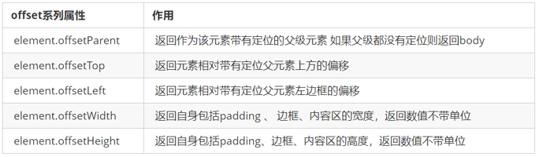
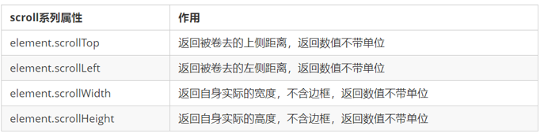

# 	BOM
`浏览器对象模型`
`把[浏览器]当做一个[对象]来看`
`BOM的顶级对象是window`
`BOM学习的是浏览器窗口交互的一些对象`
`BOM兼容性差`

- BOM比DOM大,包含DOM

## window对象

1. 全局作用域对象
2. 保存所有原生js:ES +DOM +BOM的可直接使用的对象和方法
3. 保存浏览器窗口相关信息和功能


## 页面（窗口）加载事件（2种）

**第1种**


window.onload 是窗口 (页面）加载事件，**当文档内容完全加载完成**会触发该事件(包括图像、脚本文件、CSS 文件等), 就调用的处理函数。


**第2种**

事件名不再加    on

```html
    <script>
        window.addEventListener('load', function() {
            var btn = document.querySelector('button');
            btn.addEventListener('click', function() {
                alert('点击我');
            })
        })
        // 多个load以下面的为准
        window.addEventListener('load', function() {
            alert(22);
        })
        // DOMContentLoaded
        document.addEventListener('DOMContentLoaded', function() {
            alert(33);
        })
    </script>
```

DOMContentLoaded:HTML+js下载完成就提前触发

window.onload  :   必须等HTML+css+js+img下载生成才触发


**移除事件监听对象**

元素.removeEventListener("事件名", 原事件处理函数对象)


如果添加事件监听对象时，使用的是匿名函数，则移除事件监听时，就不可能获得原事件处理函数对象的原地址。只要无法获得原事件处理函数原地，都无法正常移除原来的事件处理函数


## 调整窗口大小事件

​	`window.onresize` 是调整窗口大小加载事件,  当触发时就调用的处理函数。

窗口宽高:

window.outerHeight

window.outerWidth

内容框宽高:

window.innerWidth

window.innerWidth

注意：

1. 只要窗口大小发生像素变化，就会触发这个事件。

2. 我们经常利用这个事件完成响应式布局。 window.innerWidth 当前屏幕的宽度

```html
    <script>
        // 注册页面加载事件
        window.addEventListener('load', function() {
            var div = document.querySelector('div');
        	// 注册调整窗口大小事件
            window.addEventListener('resize', function() {
                // window.innerWidth 获取窗口大小
                if (window.innerWidth <= 800) { // 窗口小于800px隐藏
                    div.style.display = 'none';
                } else {
                    div.style.display = 'block';
                }
            })
        })
    </script>
    <div></div>
```

##  定时器（两种）

window 对象给我们提供了 2 个非常好用的方法-定时器。

- setTimeout() 

- setInterval()  

#### setTimeout() 炸弹定时器    (单次)
#### setInterval() 闹钟定时器   (重复)
> window.setTimeout(调用函数,延时时间)
> window可以省略
> 单位ms
``` html
 <script>
        /*time1和*time2的时间同时记时*/
        //写法1:
        var time1 = setTimeout(function() {
                console.log('时间到');
            }, 2000) //延时2s

        //写法2:
        function fun() {
            console.log('写法2');
        }
        var time2 = setTimeout(fun, 3000); //延时3s
    </script>
```
#### 停止定时器
` clearTimeout(定时器id);`
` clearInterval(定时器id);`

```html
    <button>点击停止定时器</button>
    <script>
        var btn = document.querySelector('button');
		// 开启定时器
        var timer = setTimeout(function() {
            console.log('爆炸了');
        }, 5000);
		// 给按钮注册单击事件
        btn.addEventListener('click', function() {
            // 停止定时器
            clearTimeout(timer);
        })
    </script>
```

## 打开新链接4种方法

> 当前窗口打开新链接,可以后退
>
> >html   : <a href="url" target="_self">
> >
> >js        :   window.open("url","_self");

​        location.assign("url");

​        location.href="url";

​        location="url";

> 在当前窗口打开，不可后退
>
> >js: location.replace("http://tmooc.cn");


> 在新窗口打开，可打开多个
>
> > html   : <a href="url" target="_blank">
> >
> > js        :   window.open("url","_blank");


> 在新窗口打开，只能打开一个
>
> > html   : <a href="url" target="自定义窗口名window.name">
> >
> > js        :   window.open("url","自定义窗口名window.name");

## location对象的常见方法

### navigator对象

​	navigator 对象包含有关浏览器的信息，它有很多属性，我们最常用的是 userAgent，该属性可以返回由客户机发送服务器的 user-agent 头部的值。

下面前端代码可以判断用户那个终端打开页面，实现跳转

navigator.userAgen保存了当前浏览器的内核名称、内核版本号等信息。

navigation.plugins保存当前浏览器已经安装的插件信息的集合

```js
if((navigator.userAgent.match(/(phone|pad|pod|iPhone|iPod|ios|iPad|Android|Mobile|BlackBerry|IEMobile|MQQBrowser|JUC|Fennec|wOSBrowser|BrowserNG|WebOS|Symbian|Windows Phone)/i))) {
    window.location.href = "地址";     //手机
 } else {
    window.location.href = "地址";     //电脑
 }
```

```js
//判断当前浏览器是否安装Chrome PDF Viewer插件
        if (navigator.plugins["Chrome PDF Viewer"] !== undefined) {
            document.write(`<h3 style="color:green">已安装Chrome PDF Viewer插件，可以浏览PDF格式的电子书</h3>`)
        } else {
            document.write(`<h3 style="color:orange">未安装Chrome PDF Viewer插件，<a href="#">点此下载安装</a></h3>`)
        }
        //判断当前浏览器是否安装Shockwave Flash插件
        if (navigator.plugins["Shockwave Flash"] !== undefined) {
            document.write(`<h3 style="color:green">已安装Flash插件，可以播放Flash格式的视频</h3>`)
        } else {
            document.write(`<h3 style="color:orange">未安装Flash插件，<a href="#">点此下载安装</a></h3>`)
        }
```


###  history对象 

​	window对象给我们提供了一个 history对象，与浏览器历史记录进行交互。该对象包含用户（在浏览器窗口中）访问过的URL。

[javascript:history.go(-1)](about:blank)后退一次

[javascript:history.go(1)](about:blank)前进一次

[javascript:history.go(0)](about:blank)刷新

history对象一般在实际开发中比较少用，但是会在一些 OA 办公系统中见到。


## offset 概述 

offset 翻译过来就是偏移量， 我们使用 offset系列相关属性可以动态的得到该元素的位置（偏移）、大小等。

1. 获得元素距离带有定位父元素的位置

2. 获得元素自身的大小（宽度高度）

3. 注意：返回的数值都不带单位
   

###  案例：获取鼠标在盒子内的坐标

1. 我们在盒子内点击，想要得到鼠标距离盒子左右的距离。
2. 首先得到鼠标在页面中的坐标（e.pageX, e.pageY）
3. 其次得到盒子在页面中的距离 ( box.offsetLeft, box.offsetTop)
4. 用鼠标距离页面的坐标减去盒子在页面中的距离，得到 鼠标在盒子内的坐标
5. 如果想要移动一下鼠标，就要获取最新的坐标，使用鼠标移动

```js
var box = document.querySelector('.box');
box.addEventListener('mousemove', function(e) {
var x = e.pageX - this.offsetLeft;
var y = e.pageY - this.offsetTop;  
this.innerHTML = 'x坐标是' + x + ' y坐标是' + y;
})
```


###  client概述

通过 client系列的相关属性可以动态的得到该元素的边框大小、元素大小等。


### 立即执行函数

<!-- 创建一个独立的作用域,避免命名冲突问题 -->
立即执行函数 `(function(){})() ` 或者 `(function(){}())`


### scroll 概述

scroll 翻译过来就是滚动的，我们使用 scroll 系列的相关属性可以动态的得到该元素的大小、滚动距离等。




### 页面被卷去的头部

如果浏览器的高（或宽）度不足以显示整个页面时，会自动出现滚动条。当滚动条向下滚动时，页面上面被隐藏掉的高度，我们就称为页面被卷去的头部。滚动条在滚动时会触发 onscroll事件。

`页面被卷去的头部：可以通过window.pageYOffset 获得` 

` 如果是被卷去的左侧window.pageXOffset`


## 三大系列总结


他们主要用法：

1.offset系列 经常用于获得元素位置    offsetLeft  offsetTop

2.client经常用于获取元素大小  clientWidth clientHeight

3.scroll 经常用于获取滚动距离 scrollTop  scrollLeft  

4.注意页面滚动的距离通过 window.pageXOffset  获得


## mouseenter 和mouseover的区别

- 当鼠标移动到元素上时就会触发mouseenter 事件
- 类似 mouseover，它们两者之间的差别是
- mouseover 鼠标经过自身盒子会触发，经过子盒子还会触发。mouseenter  只会经过自身盒子触发
- 之所以这样，就是因为mouseenter不会冒泡
- 跟mouseenter搭配鼠标离开 mouseleave  同样不会冒泡

## 移动端事件

### 触屏事件概述 

常见的触屏事件如下：


touchstart
touchmove
touchend

###  触摸事件对象（TouchEvent）


`重点记住 targetTocuhes`

